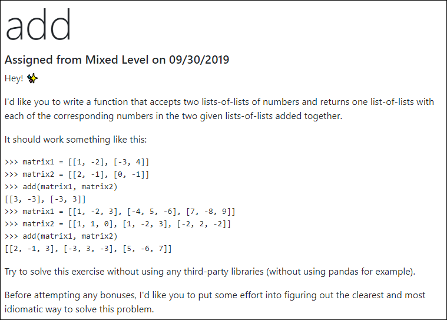
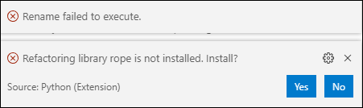

# Day 1-2

This challenge comes from [Python Morsels](https://www.pythonmorsels.com/exercises/cb8fbdd52cf14f8cb31df4f06343cccf/) (must have a current subscription to access this link). 

Screenshot:



## My Approach

The simple approach will be to break down each list of lists into a a new one dimensional list, do the math, and then parse into new lists using the length of each list to do the parsing.

## Solution

Extracting the numbers and doing the addition was fairly easy, but I had to ask the Internet how to create the new sub-lists.

* [https://www.google.com/search?q=split+python+list+into+sublists](https://www.google.com/search?q=split+python+list+into+sublists)

The solution appeared at [stackoverflow](https://stackoverflow.com/questions/9671224/split-a-python-list-into-other-sublists-i-e-smaller-lists) (where else?!!) with this code snippet that uses list comprehension, a technique I admit I have to learn better:

```chunks = [data[x:x+100] for x in range(0, len(data), 100)]```

## What I Learned

* I have to learn more about list comprehension.
* From [PEP 8](https://www.python.org/dev/peps/pep-0008/):
    > Function names should be lowercase, with words separated by underscores as necessary to improve readability. Variable names follow the same convention as function names.
* Python [f-strings](https://realpython.com/python-f-strings/) are awesome. I highly recommend you use them whenever printing more than one item on a line.
* Comments in Markdown are a pain the a$$. See [here](https://stackoverflow.com/questions/4823468/comments-in-markdown) for why.
* When you try to refactor for the first time VS Code offers to install the required extension:

