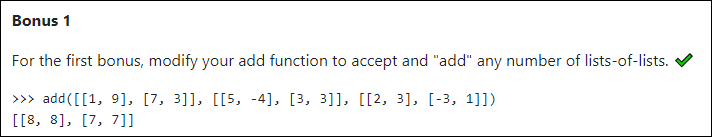

# Day 2

This challenge comes from [Python Morsels](https://www.pythonmorsels.com/exercises/cb8fbdd52cf14f8cb31df4f06343cccf/) (must have a current subscription to access this link). 

Screenshot:

## My Approach

My function now only accepts two lists. This will have to be adapted to accept only one list of lists. 

## Solution

_In progress!_

## What I Learned

_In progress!_
