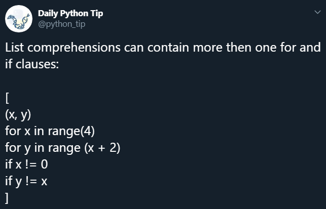

# Day 7-11

## Today's Goals

To do more Hackerrank challenges.

## What I Learned

For today's entry I'm consolidating the learning from a number of days, since I've mostly been concentrating on Hackerrank challenges for them.

Today I reinforced the basic data types including lists, dictionaries, and tuples by completing a number of [Hackerrank](https://www.hackerrank.com) challenges.

One thing that caught me in list processing was that `'10'` comes before `'2'` when sorted (because they're strings, not numbers), so I had to make sure to convert the numbers to integers (`int(n)`) before appending to or inserting into a list.

I learned that the `hash()` function only accepts immutable objects, so if you want to hash a list (which is mutable) you have to convert it to a tuple. [[006-Tuples](../../Hackerrank/02-Basic-Data-Types/006-Tuples.py)]

Reinforced many boolean string methods.

Shared this great [Tweet](https://twitter.com/python_tip/status/1181958913283018753) about list comprehension:

I did not know about the `textwrap` library. This makes wrapping text so easy! [[tutorial link](https://www.hackerrank.com/challenges/text-wrap/tutorial)]

---

See the [Hackerrank folder](../../Hackerrank/) for today's work.
