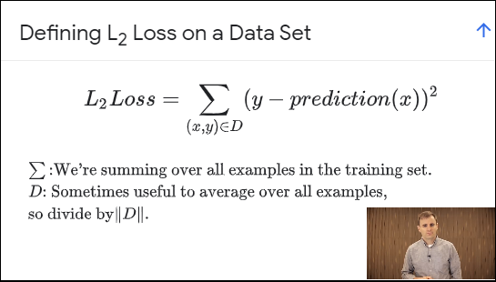
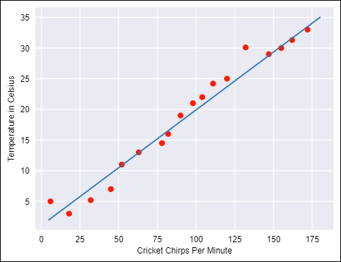
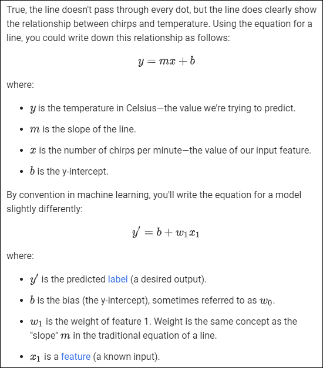

# Google Machine Learning Course

URL: [https://developers.google.com/machine-learning/crash-course/](https://developers.google.com/machine-learning/crash-course/)

## Contents

- [Introduction to Machine Learning](#introduction-to-machine-learning)
- [Framing](#framing)
  * [Video](#video)
  * [Framing: Key ML Terminology](#framing--key-ml-terminology)
  * [Check your Understanding](#check-your-understanding)
- [Descending into ML](#descending-into-ml)
  * [Video](#video-1)
  * [Linear Regression](#linear-regression)
  * [Training and Loss](#training-and-loss)
  * [Check Your Understanding](#check-your-understanding)
- [Reducing Loss](#reducing-loss)
  * [Video](#video-2)
  * [An Iterative Approach](#an-iterative-approach)
  * [Gradient Descent](#gradient-descent)

<small><i><a href='http://ecotrust-canada.github.io/markdown-toc/'>Table of contents generated with markdown-toc</a></i></small>

## Introduction to Machine Learning

URL: [https://developers.google.com/machine-learning/crash-course/ml-intro](https://developers.google.com/machine-learning/crash-course/ml-intro)

This module introduces Machine Learning (ML).

- Goals:
  - Reduce time programming
  - Customize and scale products
  - Complete seemingly "unprogrammable" tasks
- ML changes how you think about a problem: use of statistics, not logic
- Rules of Machine Learning, [Rule #1: Don't be afraid to launch a product without machine learning](https://developers.google.com/machine-learning/rules-of-ml/#rule_1_dont_be_afraid_to_launch_a_product_without_machine_learning)

## Framing

URL: [https://developers.google.com/machine-learning/crash-course/framing/video-lecture](https://developers.google.com/machine-learning/crash-course/framing/video-lecture)

### Video

This module investigates how to frame a task as a machine learning problem, and covers many of the basic vocabulary terms shared across a wide range of machine learning (ML) methods.

Key terms/phrases:

- ML systems learn
- Labels
- Features
- Examples
- Labeled example
- Unlabeled example
- Model

See [Framing: Key ML Terminology](https://developers.google.com/machine-learning/crash-course/framing/ml-terminology) for definitions.

### Framing: Key ML Terminology

URL: [https://developers.google.com/machine-learning/crash-course/framing/ml-terminology](https://developers.google.com/machine-learning/crash-course/framing/ml-terminology)

### Check your Understanding

URL: [https://developers.google.com/machine-learning/crash-course/framing/check-your-understanding](https://developers.google.com/machine-learning/crash-course/framing/check-your-understanding)

## Descending into ML

### Video

URL: [https://developers.google.com/machine-learning/crash-course/descending-into-ml/video-lecture](https://developers.google.com/machine-learning/crash-course/descending-into-ml/video-lecture)

**Linear regression** is a method for finding the straight line or hyperplane that best fits a set of points. This module explores linear regression intuitively before laying the groundwork for a machine learning approach to linear regression.

- Learning from Data
- House square feet vs house price model
- Labelled examples
- y = wx + b (not _m_x + b)
- loss is an indication of how inaccurate the model is based on a regression fit
- L2 Loss aka Squared Error:
- = (observation - prediction)2
- = (y -y')2
- must minimize loss on entire data set by coming up with best fit

### Linear Regression

URL: [https://developers.google.com/machine-learning/crash-course/descending-into-ml/linear-regression](https://developers.google.com/machine-learning/crash-course/descending-into-ml/linear-regression)

- Cricket chirp frequency vs temperature graph

### Training and Loss

URL: [https://developers.google.com/machine-learning/crash-course/descending-into-ml/training-and-loss](https://developers.google.com/machine-learning/crash-course/descending-into-ml/training-and-loss)

Training a model simply means learning (determining) good values for all the weights and the bias from labeled examples. In supervised learning, a machine learning algorithm builds a model by examining many examples and attempting to find a model that minimizes loss; this process is called empirical risk minimization.

Loss is the penalty for a bad prediction. That is, loss is a number indicating how bad the model's prediction was on a single example. If the model's prediction is perfect, the loss is zero; otherwise, the loss is greater. The goal of training a model is to find a set of weights and biases that have low loss, on average, across all examples. For example, Figure 3 shows a high loss model on the left and a low loss model on the right. 

- Loss
- Predictions
- Squared Loss (L2 Loss)
  > = the square of the difference between the label and the prediction 
  = (observation - prediction(x))2 
  = (y - y')2
- Linear Regression
- Mean square error (MSE): Although MSE is commonly-used in machine learning, it is neither the only practical loss function nor the best loss function for all circumstances.

### Check Your Understanding

URL: [https://developers.google.com/machine-learning/crash-course/descending-into-ml/check-your-understanding](https://developers.google.com/machine-learning/crash-course/descending-into-ml/check-your-understanding)

## Reducing Loss

### Video

To train a model, we need a good way to reduce the model’s loss. An iterative approach is one widely used method for reducing loss, and is as easy and efficient as walking down a hill.

Learning Objectives:

- Discover how to train a model using an iterative approach.
- Understand full gradient descent and some variants, including:
  - mini-batch gradient descent
  - stochastic gradient descent
- Experiment with learning rate.

### An Iterative Approach

URL: [https://developers.google.com/machine-learning/crash-course/reducing-loss/an-iterative-approach](https://developers.google.com/machine-learning/crash-course/reducing-loss/an-iterative-approach)

Key Point: A Machine Learning model is trained by starting with an initial guess for the weights and bias and iteratively adjusting those guesses until learning the weights and bias with the lowest possible loss.

Key Terms:

- convergence
- training
- loss

### Gradient Descent

URL: [https://developers.google.com/machine-learning/crash-course/reducing-loss/gradient-descent](https://developers.google.com/machine-learning/crash-course/reducing-loss/gradient-descent)

