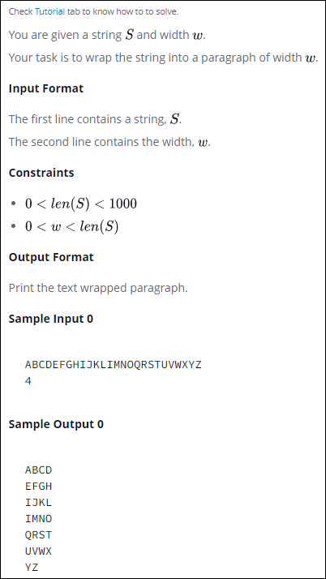
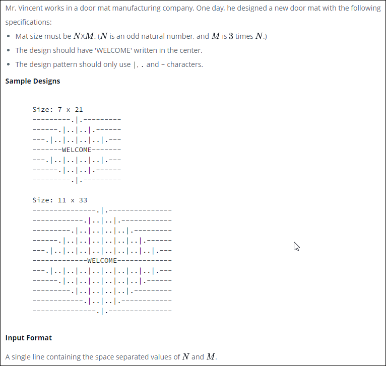
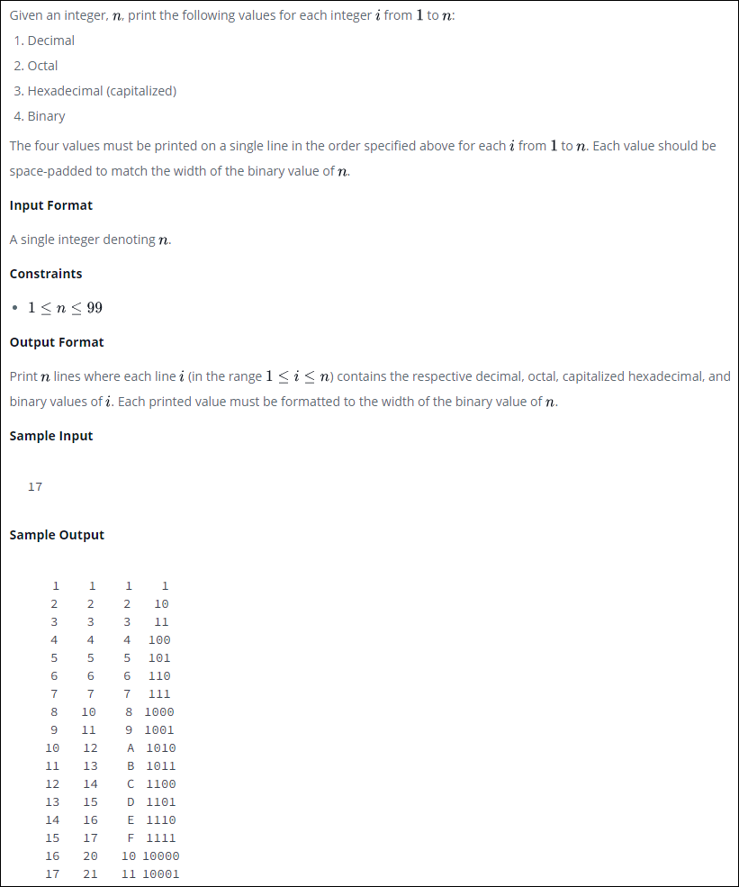

### 001-sWAP-cASE.py

### 002-String-Split-and-Join.py

### 003-Whats-Your-Name.py

### 004-Mutations.py

### 005-Find-a-string.py

### 006-String-Validators.py

### 007-Text-Alignment.py

### 008-Text-Wrap.py

### 009-Designer-Door-Mat.py

### 010-String Formatting.py

