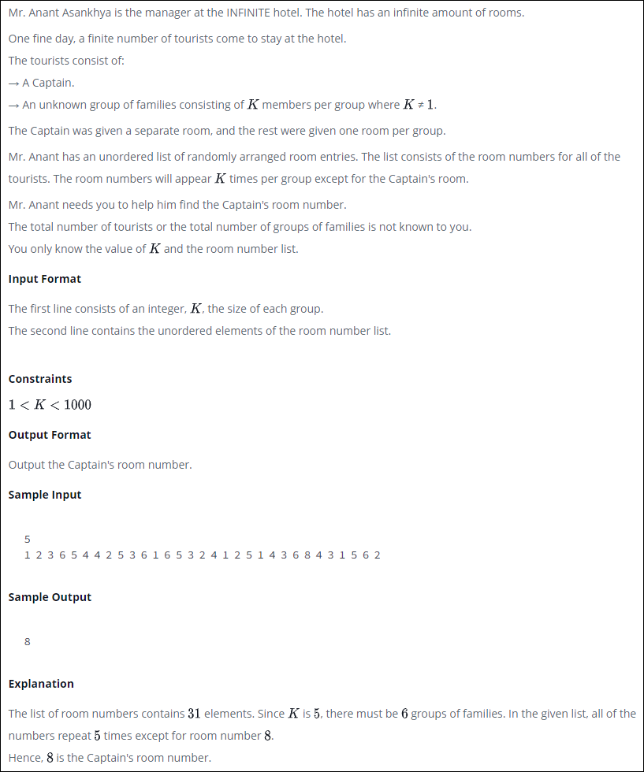

### 01-Introduction-to-Sets.py

### 02-No-Idea.py

### 03-Symmetric-Differences.py

### 04-Set.add().py

.png)

### 05-Set-.union()-Operation.py

-Operation.png)

### 06-Set-.intersection()-Operation

-Operation.png)

## 07-Set-.difference()-Operation.py

-Operation.png)

## 08-Set-.symmetric_difference()-Operation

-Operation.png)

## 09-Set-.discard(),-.remove()-&-.pop().py

,-.remove()-&-.pop().png)

## 10-The-Captain's-Room.py

