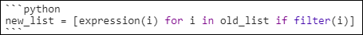

# Markdown Tips

## Sections

- [Style Guide](#style-guide)
- [Formatting:](#formatting-)
- [VS Code Extensions that Help with Markdown](#vs-code-extensions-that-help-with-markdown)
- [Other Tips](#other-tips)

<small><i><a href='http://ecotrust-canada.github.io/markdown-toc/'>Table of contents generated with markdown-toc</a></i></small>

## Style Guide

1. [Here's](https://github.com/DavidAnson/markdownlint/blob/v0.16.0/doc/Rules.md) a set of rules to follow for Markdown.
1. The first line should always be a level-1 ('#') heading containing the title of the document. The title does not have to be the same as the filename.
1. There must always be a blank line at the end of the document.
1. Each line cannot have any trailing spaces.
1. Use two spaces for an indent, not a tab.
1. It's preferable to use a hyphen for unordered lists, even if asterisks work also. The Markdown linter will complain if you use different ones in your document.

## Formatting:

1. For a blockquote, prepend '>' to the quoted text. It will appear like this:
    > This is a blockquote.
1. Surround your text with two asterisks (**) for **bold**.
1. Surround your text with one asterisk (*) for *italics*. Optionally, underscores (_) also work.
1. Surround your text with three asterisks (***) for ***bold and italic***.
1. Pictures are formatted like this:<br>
    > ``````
1. Codeblocks are entered like this:

    

    Note the word 'Python' appended to the first line of back-ticks.
    
## VS Code Extensions that Help with Markdown

1. [Paste URL](https://marketplace.visualstudio.com/items?itemName=kukushi.pasteurl) is fantastic for pasting in links to websites. If you don't have any text highlighted when you paste the URL (using Ctrl-Alt-P) then the extension will automatically grab the title of the page and apply the link to it. What a time-saver! If you do have some text highlighted when you paste in the URL it will simply apply the URL to the highlighted text using the appropriate syntax.
1. [markdownlint](https://marketplace.visualstudio.com/items?itemName=DavidAnson.vscode-markdownlint) can be used to check for errors in your Markdown.
1. [MarkDown Link Suggestions](https://marketplace.visualstudio.com/items?itemName=TomasHubelbauer.vscode-markdown-link-suggestions) is fantastic for entering links to other documents.

## Other Tips

1. The table of contents can be generated at this website: [ecotrust-canada.github.io/markdown-toc/](https://ecotrust-canada.github.io/markdown-toc/)
