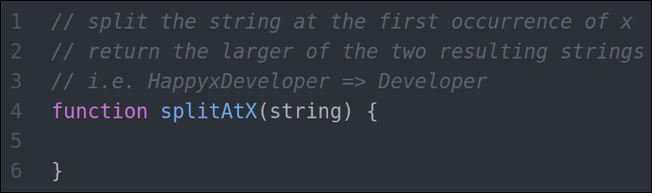

# SplitAtX

I found this challenge on [Twitter](https://twitter.com/BeingDanNolan/status/1179837518193266693). Thanks to [@BeingDanNolan
](https://twitter.com/BeingDanNolan) for this!

I've also coded a simpler solution with no function parameters and fixed (not random) x and string values (see req'ts)

