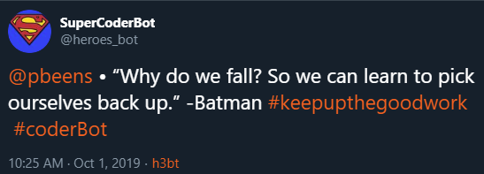

# Social Media Log

Day 01

* [https://twitter.com/pbeens/status/1178500218943365120](https://twitter.com/pbeens/status/1178500218943365120)

    > If you already know some #Python I would recommend this course:  [https://coursera.org/learn/program-code](https://coursera.org/learn/program-code) 
    > If you're new to Python, take this course first: [https://coursera.org/learn/learn-to-program](https://coursera.org/learn/learn-to-program) Both courses are excellent!

* https://twitter.com/pbeens/status/1178922637877268481
    > Why Flask and not Django?

Day 02

* [https://twitter.com/pbeens/status/1178908007444254720](https://twitter.com/pbeens/status/1178908007444254720)
    > @dbader_org, any tips on what should be included in a well-written #Python program header? Is there a standard for this? Thanks!
* I've been targetted by a Twitter bot! 

